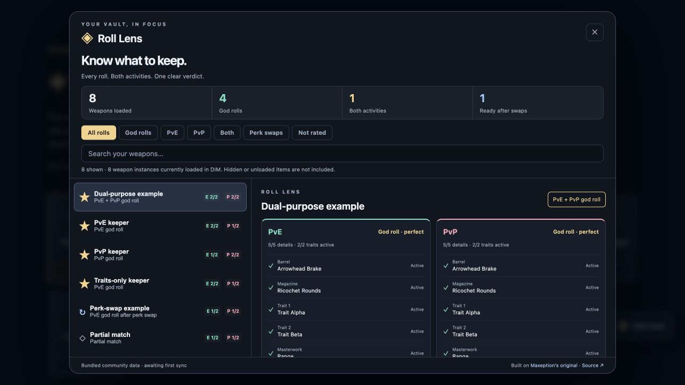

# ◈ DIM Roll Lens

**Know immediately whether your weapon is a PvE god roll, a PvP god roll, or both.**

Roll Lens is a browser extension for [Destiny Item Manager](https://app.destinyitemmanager.com/). It puts readable verdicts on your weapon tiles and explains exactly which recommended perks you have, which are selectable, and which are missing.

Built on [Maxeption’s dim-aegis-overlay](https://github.com/Maxeption/dim-aegis-overlay). **Thank you, Maxeption, for the original project and its foundation.** Original Git history and contributor attribution are preserved. See [credits](CREDITS.md).



*Screenshot of the interactive demo. These synthetic rolls are interface examples, not a real inventory or current weapon recommendations.*

## What you see

| Tile label | Meaning |
| --- | --- |
| **PVE** | Your active perks meet the PvE god-roll definition. |
| **PVP** | Your active perks meet the PvP god-roll definition. |
| **BOTH** | Your active perks meet both definitions at the same time. |
| **PVE-1** | Exactly one required PvE slot is not an active match. |
| **PVP-1** | Exactly one required PvP slot is not an active match. |
| **No label** | All other rolls, including fixed exotics, unrated items and rolls two or more slots away. |

God-roll labels take priority. A PvE god roll that is one perk short for PvP shows **PVE**. If both activities are one perk short, it shows **PVE-1 PVP-1**. A `-1` perk may be selectable or missing; open the item for that distinction. Other overlay tier/grade badges are hidden while Roll Lens is enabled, including armor badges. Detailed explanations remain available in the dashboard and item cards.

PvE uses **Aegis**. PvP uses **Finnald / Pride Eternal**. Activity verdicts use actual perk matches, independently of the weapon’s meta tier and optional Light.gg popularity grade.

- **Both traits**, the default: both recommended main traits must be active. Barrel, magazine and masterwork matches appear in the breakdown. A complete match is marked **perfect**.
- **Every detail**: every specified barrel, magazine, main trait and masterwork must match. Unspecified slots add no requirement. A matching inactive perk produces a swap verdict, not an active god-roll verdict.

The dropdown in the toolbar popup selects your definition. Each item’s explanation identifies its community source. Recommendations are opinions and can change with the sandbox; the extension does not invent build or activity advice beyond the source notes.

## Features

- Simultaneous PvE, PvP and both labels, with optional keeper outlines.
- A **Roll Lens** button inside DIM opens a searchable inventory overview.
- Filter god rolls by activity, find perk swaps, and inspect unrated weapons.
- Clean tile labels only for god rolls and rolls one required slot away. Separate active, selectable and missing perks in the detailed breakdown, plus masterwork matching and source notes.
- Keyboard-accessible dialog, search, filters and close controls; narrow-screen layout.
- Bundled public recommendations for an offline first load, plus daily refresh. Failed/empty refreshes preserve cached ratings.
- Simple toolbar settings with upstream advanced customization, wishlist, armor, explorer and optional Light.gg tools still available.

The dashboard counts **weapon instances currently loaded in DIM’s DOM**. It does not promise a complete account scan. Load your inventory and show the characters/items you want to inspect. The extension only displays recommendations; item operations stay in DIM.

## Install

Download the correct ZIP from [Releases](https://github.com/Moriz82/dim-roll-lens/releases/latest) and extract it. Disable any other Aegis overlay extension first to avoid duplicate overlays.

### Firefox / Firefox Nightly

The GitHub Firefox build is **unsigned** and supports temporary developer loading:

1. Open `about:debugging#/runtime/this-firefox`.
2. Click **Load Temporary Add-on…**.
3. Select `manifest.json` in the extracted **firefox** folder.
4. Reload DIM. Open **Roll Lens** at the bottom right.

Firefox removes temporary add-ons when it restarts. A persistent install requires Mozilla signing; this project is not yet published on Mozilla Add-ons. There is no need to disable Firefox signature checks.

### Chrome / Chromium / Brave / Edge

1. Open the browser’s extensions page and enable **Developer mode**.
2. Click **Load unpacked** and select the extracted **chromium** folder.
3. Reload DIM.

DIM stable and beta are supported. Winnower compatibility is inherited from upstream. The new dashboard is intended for DIM. This project is independent of Bungie, DIM, Maxeption and the recommendation authors.

## Develop

Use Node **24 LTS** or another Vite 8 supported version.

```sh
npm ci
npm test
npm run build:all
npm run test:integration
node scripts/verify-package.mjs
```

- `dist/`: unpacked Chromium extension.
- `releases/firefox/`: Firefox extension with the correct manifest.
- `releases/chromium/`: Chromium extension.
- `releases/*.zip`: separately packaged browser builds with nested paths preserved.

Run `npm run dev` and open `/preview.html` for an interactive synthetic inventory using the same verdict engine and UI. This demo does not log into Bungie or read your vault.

## Validation and limits

Unit/DOM tests cover activity separation, swaps, strict matching, fixed/unrated weapons, HTML escaping, filters, search and dialog focus. Built-bundle integration tests check real bundled recommendation parsing, mutation-triggered rescoring, badge deduplication, missing-source isolation and failed-sync cache retention. Package validation checks both manifests and every required ZIP path. Browser QA covers the desktop/narrow layouts and actionable swap details.

The Firefox release was also temporarily loaded and tested against a signed-in DIM inventory on October 6, 2026, in Firefox Nightly 157.0a1. Live tile badges, the dashboard, activity filters, item explanations and perk-swap guidance were checked. See [validation](docs/VALIDATION.md) for the scope. The DIM bridge reads React item data and is inherited from upstream; DIM changes can break it. Bundled source data comes from the upstream snapshot; a successful refresh means the cache was retrieved, not that its author has revised every weapon for the latest sandbox.

Custom wishlists hosted at `raw.githubusercontent.com` work with the supplied permissions. Other domains need an explicit host-permission change. [Privacy](PRIVACY.md) explains local data and network use.

## Credits and license

**Thanks again to [Maxeption](https://github.com/Maxeption)** and all upstream contributors. Recommendations and supporting work are credited to Aegis, Finnald, LowCo, Azra, Revadike, MrCharles, DIM and Bungie in [CREDITS.md](CREDITS.md). Third-party notices remain included in the extension.

[MIT](LICENSE), following the license declared by the original project. Game assets and bundled community data retain their respective attribution.
